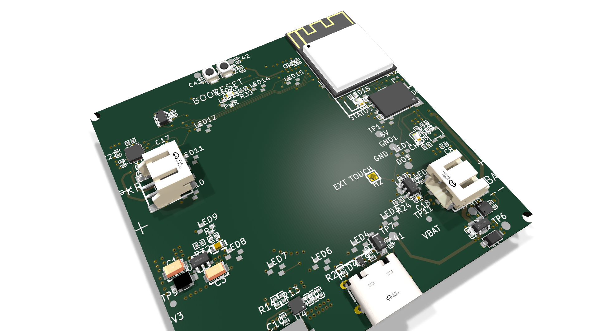
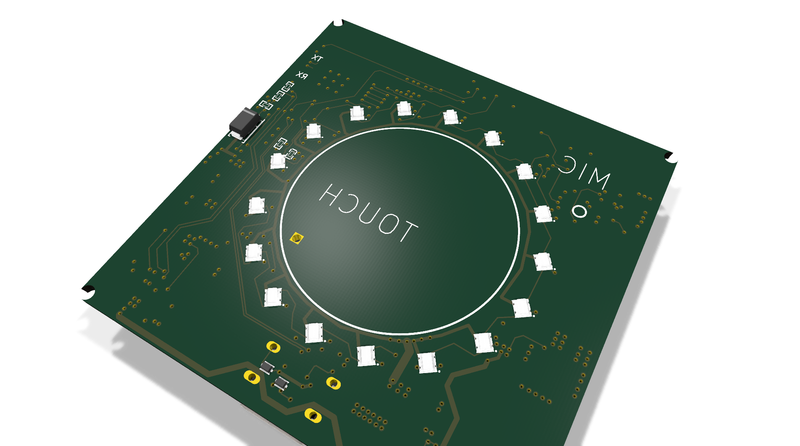
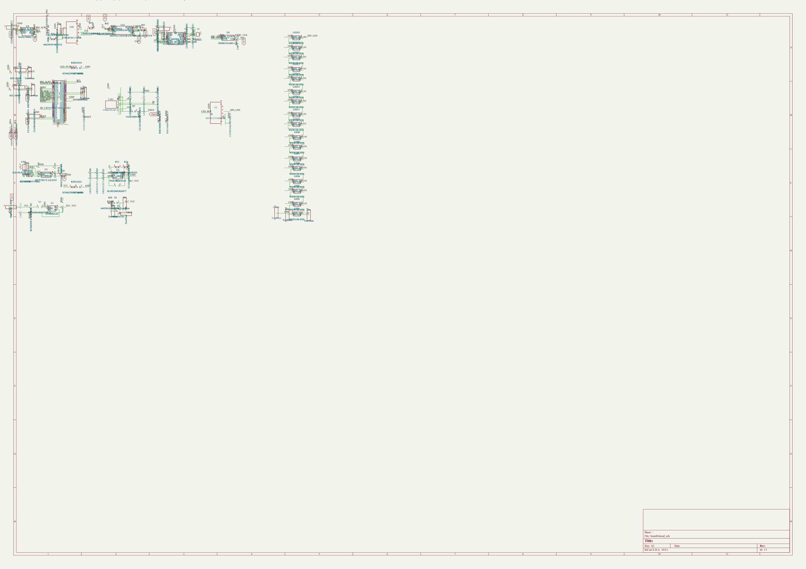

# Restaurant Pager — Circular Touch + LED Ring

ESP32-controlled circular restaurant table pager: a central capacitive **TOUCH** pad surrounded by a 16-LED ring of WS2812B addressable RGBs, plus a **MIC** for audio.

Designed in EasyEDA Pro. Sources here are the **KiCad-converted** form produced by `_backup-tooling/epcb_to_kicad.py` and `_backup-tooling/esch_to_kicad_sch.py`. Original EasyEDA `.epro` archive preserved in `source/` for re-editing.

## At a Glance

- **Board size**: 60 × 60 mm, 4-layer
- **Components**: 101 placed, 17× WS2812B-2020 addressable LEDs forming a ring around a central capacitive touch pad
- **Tracks**: 1,051 (top + bottom)
- **Vias**: 288 (0.305 mm drill / 0.61 mm pad)
- **Copper zones**: 18 (GND + power pours)
- **Schematic**: 200 component instances (101 placed + power/test points), 405 wires
- **Status**: Routed and assembled (manufactured version)

## Renders

3D models for **48 of 101 components** come from the LCSC library (fetched via easyeda2kicad). The ESP32-S3 module, JST-PH connectors, USB-C receptacle, MIC package, and LED bodies are visible with real geometry. The remaining components fall back to flat pad placeholders.

### 3D top (controller side)
The labelled side: PWR / STATUS / 5V / GND / CHG / EXT TOUCH / LED OUT / BAT / VBAT / USB / SPKR / 3V3 / BOOT / RESET test points around the **ESP32-S3 module** (top), JST-PH connectors (left + right), USB-C (bottom right).



### 3D bottom (sensor side)
The user-facing side: central round **TOUCH** pad with a ring of 16 WS2812B-2020 RGB LEDs (real 3D bodies visible), **MIC** package on the side, 4 corner mounting/test pads.



## Schematic

Converted from EasyEDA `.esch` to KiCad 10 `.kicad_sch`. **39 of 44 unique component symbols use real geometry parsed from the EasyEDA `.esym` source files** (matching pin counts, pin positions, body rectangles). The remaining 5 fall back to generic KiCad library symbols.

Also extracted from `.esch`: **154 NET labels** on wire endpoints, **17 global labels** (power rails: 3V3, 5V, GND, VBAT, etc.), **27 no-connect markers**, and **405 wire segments** — preserving the exact connectivity of the original.



Full vector PDF: [board-4/reports/schematic.pdf](board-4/reports/schematic.pdf)

## Files

- `board-4/board4.kicad_pcb` — KiCad 10 PCB layout (converted from `.epcb`)
- `board-4/board4.kicad_sch` — KiCad 10 schematic (converted from `.esch`)
- `board-4/reports/board-3d.png`, `board-3d-back.png` — angled raytraced 3D views
- `board-4/reports/pcb-top.svg`, `pcb-bottom.svg` — copper artwork
- `board-4/reports/schematic.pdf`, `schematic.png` — schematic in PDF + raster
- `board-4/reports/bom.csv` — 101-component BOM with MPN-ish library references (most include LCSC codes)
- `board-4/reports/board-stats.json` — KiCad-computed board statistics
- `source/Restaurant table pager circular.epro` — original EasyEDA Pro project archive
- `source/` also holds the source dump if you re-extract; original lives at the .epro zip

## How this repo was produced

The conversion pipeline lives at `_backup-tooling/` in the parent workspace:

```bash
# 1. PCB conversion (EasyEDA Pro .epcb -> .kicad_pcb)
python epcb_to_kicad.py source/extracted/PCB/<pcb-uuid>.epcb \
    -o board-4/board4.kicad_pcb \
    --footprint-dir source/extracted/FOOTPRINT \
    --project-json source/extracted/project.json \
    --title "Restaurant Pager Circular - Board 4"

# 2. Schematic conversion (EasyEDA Pro .esch -> .kicad_sch, KiCad 10 format)
python esch_to_kicad_sch.py source/extracted/SHEET/<sheet-uuid>/1.esch \
    -o board-4/board4.kicad_sch

# 3. Render artifacts via kicad-cli (3D PNGs, copper SVGs, schematic PDF)
kicad-cli pcb render --rotate -30,0,30 --quality high --floor --perspective \
    -w 1920 -h 1080 --side top -o board-4/reports/board-3d.png board-4/board4.kicad_pcb
kicad-cli sch export pdf -o board-4/reports/schematic.pdf board-4/board4.kicad_sch
```

Schematic emitter patterns are based on [eencyclopedia/lib/kicad/fromEditorState.ts](https://github.com/manhoosbilli1) — a hand-rolled, test-covered KiCad 10 writer.

## Caveats (Phase 1 conversion)

- **101/101 components rendered** on PCB (real pad geometry from `.efoo` library + embedded test-point footprints). Some component rotations or silkscreen positions may be slightly off from the original due to coordinate-frame conventions — this is a known issue in the converter, see `_backup-tooling/epcb_to_kicad.py`.
- **Schematic component symbols** are generic KiCad library placeholders, not full visual replicas of the EasyEDA symbols (would need a per-symbol mapping table).
- **Net connectivity** is preserved at the data level (PAD_NET records → KiCad net IDs) but won't pass DRC/ERC as-is.
- The `.epro` archive in `source/` is the authoritative original — re-import to EasyEDA Pro for any active editing.
